<h1 align="center">immo</h1>
<p align="center"><strong>Analyse du marche immobilier francais</strong></p>
<p align="center">
  Outil en ligne de commande pour le telechargement, l'analyse et la prevision des prix immobiliers
  a partir des donnees DVF (Demandes de Valeurs Foncieres) publiees par data.gouv.fr.
</p>

<p align="center">
  =3.11" />
  
  
  
  
</p>

<p align="center">
  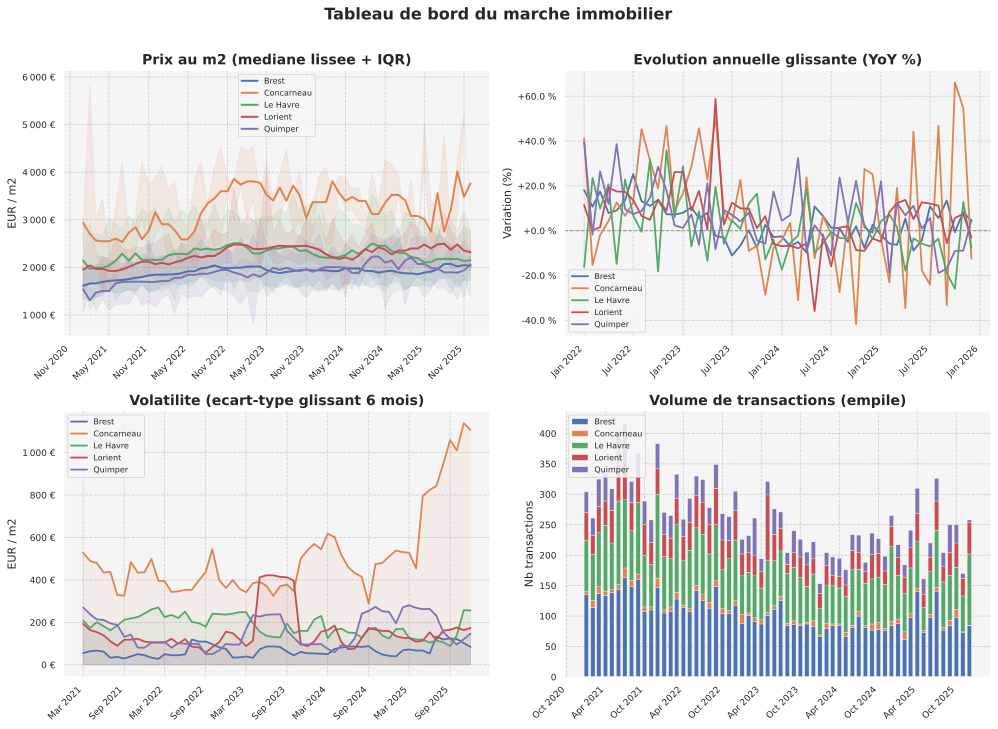
</p>

---

## Fonctionnalites

| Module                  | Description                                                                                          |
|-------------------------|------------------------------------------------------------------------------------------------------|
| Pipeline DVF            | Telechargement et mise en cache (Parquet) des transactions immobilieres depuis data.gouv.fr          |
| Analyse multi-echelle   | Agregation mensuelle par commune, groupe personnalise, departement ou region                         |
| Signaux achat/vente     | Score composite a partir de 5 indicateurs : z-score, momentum, retour a la moyenne, volume, taux    |
| Previsions              | Modeles Prophet, regression lineaire et ensemble avec intervalles de confiance                       |
| Impact des taux         | Simulation de capacite d'emprunt, sensibilite aux taux, pouvoir d'achat indexe                      |
| Estimateur renovation   | Chiffrage detaille des travaux de renovation (gros oeuvre, second oeuvre, finitions)                  |
| Rapports PDF            | Generation de rapports multi-pages avec graphiques de tendances, signaux et previsions               |

---

## Apercu des graphiques

### Tendances de prix et bande IQR

<p align="center">
  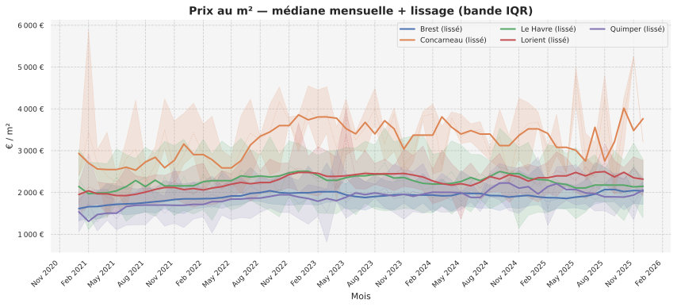
</p>

### Signaux achat / vente

<p align="center">
  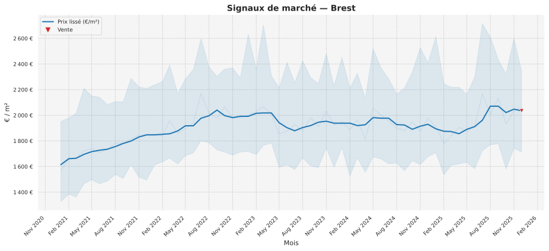
</p>

### Previsions (Prophet + regression lineaire)

<p align="center">
  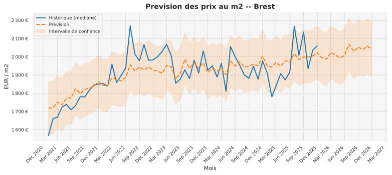
</p>

<p align="center">
  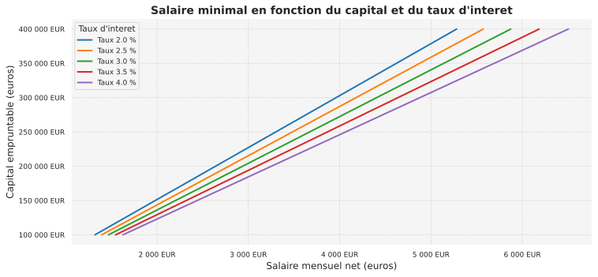
  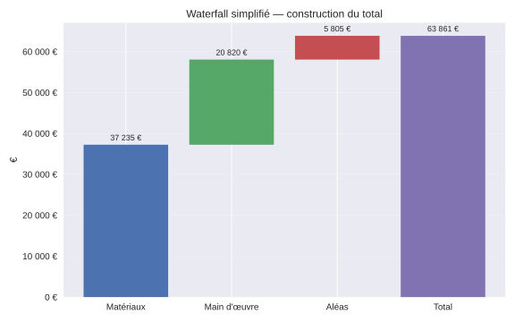
</p>

<p align="center">
  <em>Gauche : impact des taux d'interet sur la capacite d'emprunt.
  Droite : ventilation des couts de renovation (waterfall).</em>
</p>

### Volume de transactions

<p align="center">
  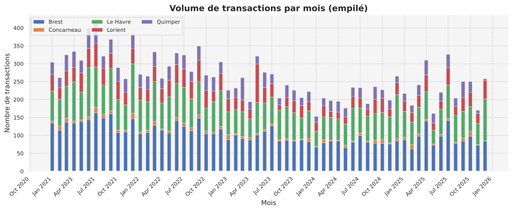
</p>

---

## Aide a la decision

Ces graphiques vont au-dela de la simple visualisation de donnees — ils repondent directement a **"j'achete ou pas, ou, et quand ?"**

### Tableau de bord decisionnaire

<p align="center">
  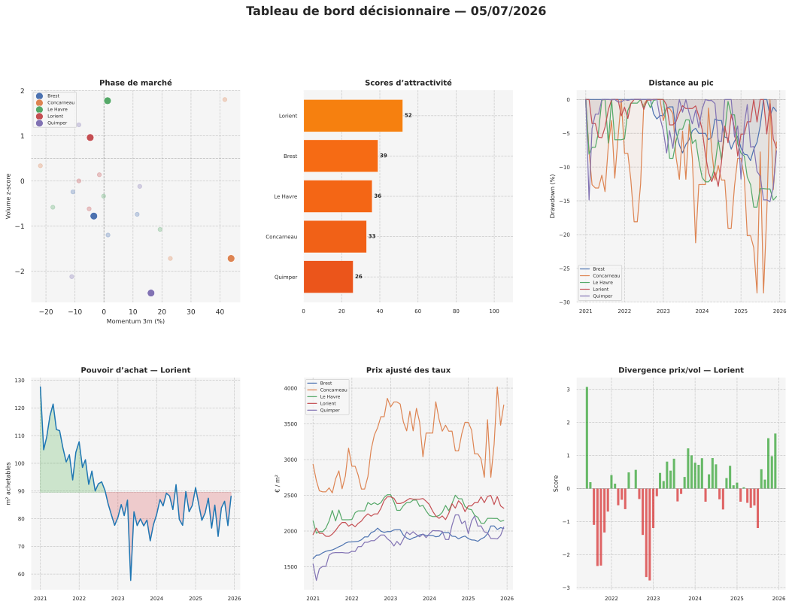
</p>

### Phase de marche (diagramme momentum x volume)

<p align="center">
  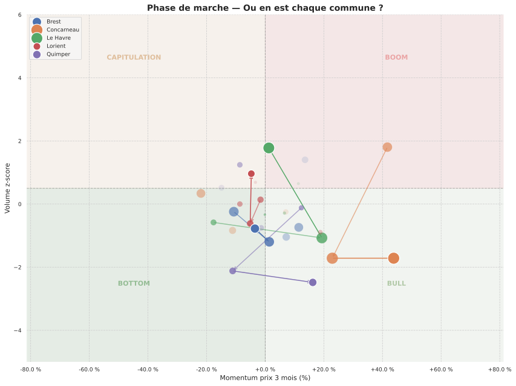
  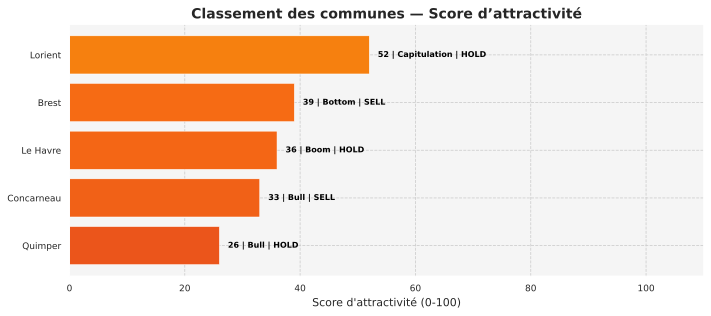
</p>

<p align="center">
  <em>Gauche : chaque commune positionnee dans son cycle (Bottom = zone d'achat, Boom = zone de vente).
  Droite : classement par score d'attractivite composite (0-100).</em>
</p>

### Pouvoir d'achat reel et drawdown

<p align="center">
  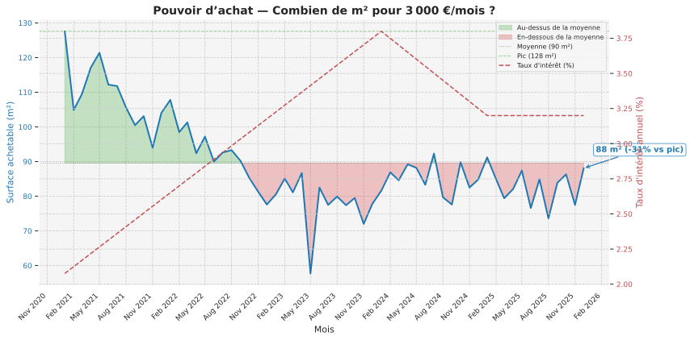
  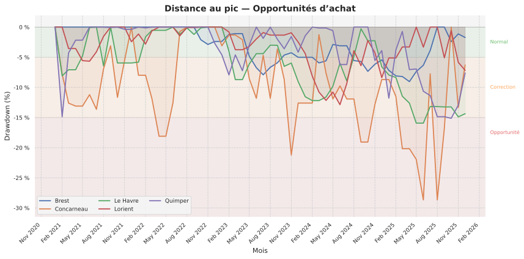
</p>

<p align="center">
  <em>Gauche : combien de m2 pour 3000 EUR/mois (combine prix ET taux d'interet).
  Droite : distance au pic — les zones rouges (&lt;-15%) signalent des opportunites.</em>
</p>

### Prix ajuste des taux

<p align="center">
  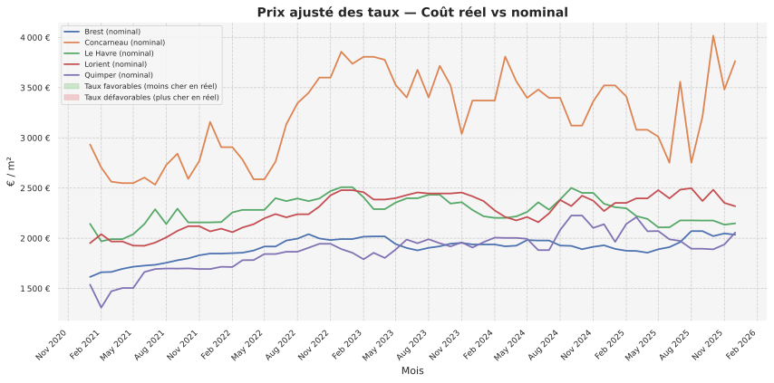
</p>

<p align="center">
  <em>Compare le prix nominal au prix "a taux constant" (3.5%). Revele si la hausse des taux masque
  une baisse reelle des prix ou l'inverse.</em>
</p>

---

## Architecture

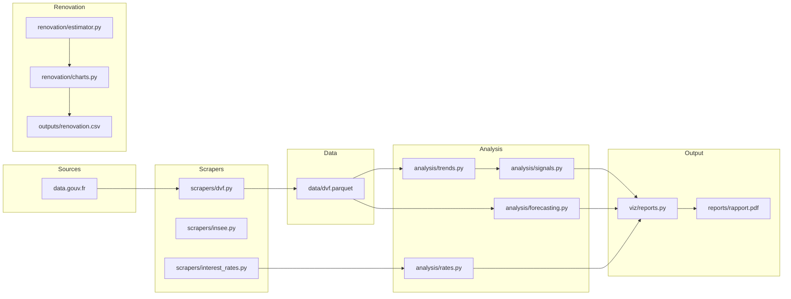

## Quickstart

```bash
pip install -e .

# Telecharger les donnees DVF
immo fetch -c config/default.yml

# Analyser les tendances et generer les signaux achat/vente
immo analyze -c config/default.yml

# Generer le rapport PDF
immo report -c config/default.yml
```

Commandes supplementaires :

```bash
# Previsions sur 12 mois
immo forecast -c config/default.yml --horizon 12

# Impact des taux d'interet
immo rates -c config/default.yml --rate 0.03 --rate 0.035 --rate 0.04

# Estimation renovation maison pierre 120 m2
immo renovation --surface 120
```

## Installation

**Installation standard :**

```bash
pip install -e .
```

**Installation avec les outils de developpement** (ruff, mypy, pytest) :

```bash
pip install -e ".[dev]"
```

Necessite **Python 3.11** ou superieur. Les principales dependances sont :
pandas, numpy, matplotlib, seaborn, prophet, scikit-learn, typer, pydantic, httpx.

## CLI Reference

Toutes les commandes acceptent l'option `--config / -c` pour specifier un fichier de configuration YAML.

| Commande            | Description                                              | Options principales                        |
|---------------------|----------------------------------------------------------|--------------------------------------------|
| `immo fetch`        | Telecharger les donnees DVF pour les communes configurees | `-o / --output` repertoire de sortie       |
| `immo analyze`      | Lancer l'analyse de tendances et generer les signaux     | --                                         |
| `immo report`       | Generer un rapport PDF avec graphiques                   | `-o / --output` chemin du PDF              |
| `immo rates`        | Analyser l'impact des taux d'interet                     | `-r / --rate` taux a tester (repetable)    |
| `immo forecast`     | Lancer la prevision des prix immobiliers                 | `-H / --horizon` horizon en mois           |
| `immo renovation`   | Estimer les couts de renovation d'un bien                | `-s / --surface` surface en m2, `-o`       |
| `immo dashboard`    | Tableau de bord interactif (a venir)                     | --                                         |

## Configuration

Le fichier `config/default.yml` controle l'ensemble du pipeline :

```yaml
communes:
  Brest:   { depart: 29, ninsee: 29019 }
  Lorient: { depart: 56, ninsee: 56121 }
  Le Havre: { depart: 76, ninsee: 76351 }

filters:
  type_local: ["Appartement"]
  valeur_fonciere_max: 500000
  surface_min: 60
  surface_max: 300

smoothing:
  kind: "rolling_median"
  window_months: 4

forecast:
  enabled: true
  horizon_months: 12
  model: "ensemble"
```

| Section           | Role                                                                                  |
|-------------------|---------------------------------------------------------------------------------------|
| `communes`        | Liste des communes a suivre avec leurs codes departement et INSEE                     |
| `filters`         | Criteres de filtrage des transactions (type de bien, prix max, surface)                |
| `grouping`        | Echelle d'agregation et option de serie globale                                       |
| `smoothing`       | Methode et fenetre de lissage des series de prix                                      |
| `interest_rates`  | Parametres pour les simulations de capacite d'emprunt                                 |
| `forecast`        | Activation, horizon et choix du modele de prevision                                   |
| `outputs`         | Repertoires et fichiers de sortie (CSV, PDF, graphiques)                              |

## Project Structure

```
src/immo/
    cli.py                      # Point d'entree CLI (Typer)
    config.py                   # Modeles Pydantic de configuration
    analysis/
        forecasting.py          # Prophet, regression lineaire, ensemble
        rates.py                # Calculs de taux, capacite d'emprunt
        signals.py              # Signaux achat/vente (5 indicateurs)
        trends.py               # Agregation mensuelle, metriques derivees
    renovation/
        charts.py               # Graphiques de ventilation des couts
        estimator.py            # Moteur de chiffrage renovation
        models.py               # Modeles Pydantic (dimensions, postes)
    scrapers/
        dvf.py                  # Telechargement et cache DVF (Parquet)
        insee.py                # Donnees INSEE complementaires
        interest_rates.py       # Recuperation des taux d'interet
    utils/
        filters.py              # Lissage et filtrage de series
        geo.py                  # Utilitaires geographiques
    viz/
        market.py               # Graphiques de marche (tendances, volumes)
        reports.py              # Generation de rapports PDF multi-pages
        signals.py              # Visualisation des signaux achat/vente
```

## Regenerer les graphiques

Les graphiques du README sont generes par le script :

```bash
python scripts/generate_readme_charts.py
```

Le workflow GitHub Actions `data-refresh.yml` regenere automatiquement ces graphiques chaque mois avec les dernieres donnees DVF.

## Contributing

```bash
ruff check src/ tests/
ruff format src/ tests/
mypy src/immo/
pytest
```

## License

MIT
