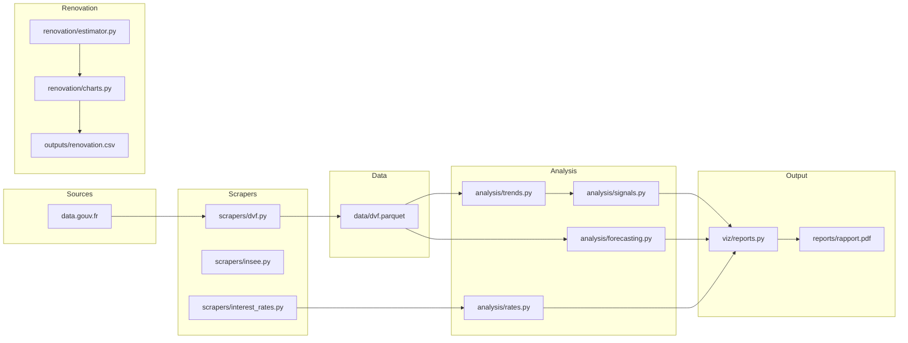

<h1 align="center">immo</h1>
<p align="center"><strong>Analyse du marche immobilier francais</strong></p>
<p align="center">
  Outil en ligne de commande pour le telechargement, l'analyse et la prevision des prix immobiliers
  a partir des donnees DVF (Demandes de Valeurs Foncieres) publiees par data.gouv.fr.
</p>

<p align="center">
  =3.11" />
  
  
  
  
</p>

---

## Fonctionnalites

| Module                  | Description                                                                                          |
|-------------------------|------------------------------------------------------------------------------------------------------|
| Pipeline DVF            | Telechargement et mise en cache (Parquet) des transactions immobilieres depuis data.gouv.fr          |
| Analyse multi-echelle   | Agregation mensuelle par commune, groupe personnalise, departement ou region                         |
| Signaux achat/vente     | Score composite a partir de 5 indicateurs : z-score, momentum, retour a la moyenne, volume, taux    |
| Previsions              | Modeles Prophet, regression lineaire et ensemble avec intervalles de confiance                       |
| Impact des taux         | Simulation de capacite d'emprunt, sensibilite aux taux, pouvoir d'achat indexe                      |
| Estimateur renovation   | Chiffrage detaille des travaux de renovation (gros oeuvre, second oeuvre, finitions)                  |
| Rapports PDF            | Generation de rapports multi-pages avec graphiques de tendances, signaux et previsions               |

## Architecture



## Quickstart

```bash
pip install -e .
immo fetch -c config/default.yml
immo analyze -c config/default.yml
immo report -c config/default.yml
```

## Installation

**Installation standard :**

```bash
pip install -e .
```

**Installation avec les outils de developpement** (ruff, mypy, pytest) :

```bash
pip install -e ".[dev]"
```

Necessite **Python 3.11** ou superieur. Les principales dependances sont :
pandas, numpy, matplotlib, seaborn, prophet, scikit-learn, typer, pydantic, httpx.

## CLI Reference

Toutes les commandes acceptent l'option `--config / -c` pour specifier un fichier de configuration YAML.

| Commande            | Description                                              | Options principales                        |
|---------------------|----------------------------------------------------------|--------------------------------------------|
| `immo fetch`        | Telecharger les donnees DVF pour les communes configurees | `-o / --output` repertoire de sortie       |
| `immo analyze`      | Lancer l'analyse de tendances et generer les signaux     | --                                         |
| `immo report`       | Generer un rapport PDF avec graphiques                   | `-o / --output` chemin du PDF              |
| `immo rates`        | Analyser l'impact des taux d'interet                     | `-r / --rate` taux a tester (repetable)    |
| `immo forecast`     | Lancer la prevision des prix immobiliers                 | `-H / --horizon` horizon en mois           |
| `immo renovation`   | Estimer les couts de renovation d'un bien                | `-s / --surface` surface en m2, `-o`       |
| `immo dashboard`    | Tableau de bord interactif (a venir)                     | --                                         |

## Configuration

Le fichier `config/default.yml` controle l'ensemble du pipeline. Structure :

```yaml
# Communes a analyser (code departement + code INSEE)
communes:
  Brest:
    depart: 29
    ninsee: 29019

# URL racine des fichiers DVF
url_root: "https://files.data.gouv.fr/geo-dvf/latest/csv/"

# Filtres appliques aux transactions
filters:
  type_local: ["Appartement"]
  valeur_fonciere_max: 500000
  surface_min: 60
  surface_max: 300

# Regroupement geographique : "commune" | "groupe" | "departement" | "region"
grouping:
  group_by: "commune"
  include_overall: false

# Lissage des series temporelles
smoothing:
  kind: "rolling_median"    # "rolling_mean" | "rolling_median" | "ewm"
  window_months: 4

# Taux d'interet pour les simulations
interest_rates:
  source: "manual"
  manual_rates: [0.02, 0.025, 0.03, 0.035, 0.04]
  loan_duration_years: 25

# Previsions
forecast:
  enabled: true
  horizon_months: 12
  model: "ensemble"         # "prophet" | "linear" | "ensemble"

# Chemins de sortie
outputs:
  metrics_csv: "outputs/metrics_communes_monthly.csv"
  report_pdf: "reports/rapport_dvf.pdf"
  charts_dir: "charts"
```

| Section           | Role                                                                                  |
|-------------------|---------------------------------------------------------------------------------------|
| `communes`        | Liste des communes a suivre avec leurs codes departement et INSEE                     |
| `filters`         | Criteres de filtrage des transactions (type de bien, prix max, surface)                |
| `grouping`        | Echelle d'agregation et option de serie globale                                       |
| `smoothing`       | Methode et fenetre de lissage des series de prix                                      |
| `interest_rates`  | Parametres pour les simulations de capacite d'emprunt                                 |
| `forecast`        | Activation, horizon et choix du modele de prevision                                   |
| `outputs`         | Repertoires et fichiers de sortie (CSV, PDF, graphiques)                              |

## Project Structure

```
src/immo/
    __init__.py
    cli.py                      # Point d'entree CLI (Typer)
    config.py                   # Modeles Pydantic de configuration
    analysis/
        __init__.py
        forecasting.py          # Prophet, regression lineaire, ensemble
        rates.py                # Calculs de taux, capacite d'emprunt
        signals.py              # Signaux achat/vente (5 indicateurs)
        trends.py               # Agregation mensuelle, metriques derivees
    renovation/
        __init__.py
        charts.py               # Graphiques de ventilation des couts
        estimator.py            # Moteur de chiffrage renovation
        models.py               # Modeles Pydantic (dimensions, postes)
    scrapers/
        __init__.py
        dvf.py                  # Telechargement et cache DVF (Parquet)
        insee.py                # Donnees INSEE complementaires
        interest_rates.py       # Recuperation des taux d'interet
    utils/
        __init__.py
        filters.py              # Lissage et filtrage de series
        geo.py                  # Utilitaires geographiques
    viz/
        __init__.py
        market.py               # Graphiques de marche (tendances, volumes)
        reports.py              # Generation de rapports PDF multi-pages
        signals.py              # Visualisation des signaux achat/vente
```

## Contributing

```bash
# Linting et formatage
ruff check src/ tests/
ruff format src/ tests/

# Verification de types
mypy src/immo/

# Tests
pytest
```

Avant de soumettre une contribution :

1. Le code doit passer `ruff check` sans erreur.
2. `mypy --strict` ne doit produire aucune erreur.
3. Les tests existants doivent rester au vert (`pytest`).

## License

MIT
